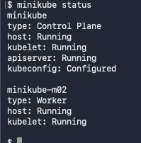

```text
 ___  __    ___  ___  ________  _______   ________  ________   _______  _________  _______   ________      
|\  \|\  \ |\  \|\  \|\   __  \|\  ___ \ |\   __  \|\   ___  \|\  ___ \|\___   ___\\  ___ \ |\   ____\     
\ \  \/  /|\ \  \\\  \ \  \|\ /\ \   __/|\ \  \|\  \ \  \\ \  \ \   __/\|___ \  \_\ \   __/|\ \  \___|_    
 \ \   ___  \ \  \\\  \ \   __  \ \  \_|/_\ \   _  _\ \  \\ \  \ \  \_|/__  \ \  \ \ \  \_|/_\ \_____  \   
  \ \  \\ \  \ \  \\\  \ \  \|\  \ \  \_|\ \ \  \\  \\ \  \\ \  \ \  \_|\ \  \ \  \ \ \  \_|\ \|____|\  \  
   \ \__\\ \__\ \_______\ \_______\ \_______\ \__\\ _\\ \__\\ \__\ \_______\  \ \__\ \ \_______\____\_\  \ 
    \|__| \|__|\|_______|\|_______|\|_______|\|__|\|__|\|__| \|__|\|_______|   \|__|  \|_______|\_________\
                                                                                               \|_________|
                                                                                                           
                                                                                                           
```


## Install Kubernetes in local machine:
### Using homebrew and minikube as a kubernetes distributor for local installation:
- `homebrew install minikube`
- Before starting the minikube, start the docker engine(Desktop). Based on available space (cores memory) try providing the space. 
- `minikube start --nodes 2`

- Check the status of your kubernetes nodes using `status`:
- `minikube status` will show below message. 
- 